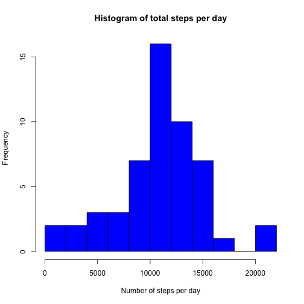
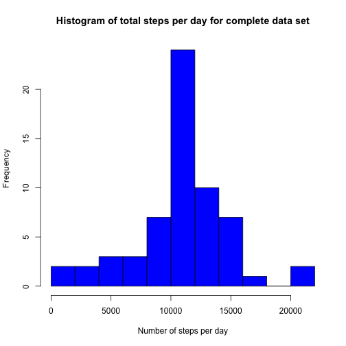
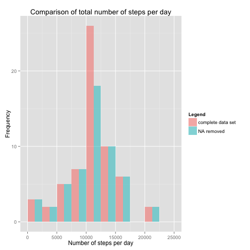

# Coursera Reproducible Research - Assignment 1

This file contains all of my R code for the first assignment of Coursera's Reproducible Research class. It is divided into the individual sections outlined in the instructions.

## Loading and preprocessing the data

This code identifies the url of the data set, downloads it, and unzips the data set into the file "activity.zip"


```r
fileurl = "https://d396qusza40orc.cloudfront.net/repdata%2Fdata%2Factivity.zip"
download.file(fileurl, destfile = "activity.zip", method = "curl")
unzip("activity.zip")
```

The unpacked file is read and stored in the data frame 'data'.


```r
data <- read.csv("activity.csv", header = TRUE, stringsAsFactors = FALSE)
```

NA values get removed:


```r
data1 <- na.omit(data)
```

## What is mean total number of steps taken per day?

The following code calculates the total number of steps taken per day:


```r
number_of_steps <- aggregate(data1[,c("steps")], by=list(data1$date), "sum")
```

The result is plotted as a histogram reporting the total number of steps per day:


```r
hist(number_of_steps$x,
     main = "Histogram of total steps per day",
     xlab = "Number of steps per day",
     col = "blue",
     breaks = 10)
```

 

The following line of code calculates the mean total number of steps taken per day:


```r
mean(number_of_steps$x)
```

```
## [1] 10766.19
```

In a similar way, the following code calculates the median for the total number of steps taken per day:


```r
median(number_of_steps$x)
```

```
## [1] 10765
```

## What is the average daily activity pattern?

To answer this question the average number of steps per interval for all days is calculated. Note: This is performed on the data set from which all rows with missing values have been removed.


```r
steps_per_interval <- aggregate(data1[,c("steps")], by=list(data1$interval), "mean")
colnames(steps_per_interval) <- c("interval", "mean_number_steps")
```

The calculated informated is plotted as the average number of steps per interval:


```r
plot(steps_per_interval$interval, steps_per_interval$mean_number_steps, 
     type = "l", 
     xlab = "interval", 
     ylab = "average steps per interval")
```

 

The following code determines which interval contains the maximum average number of steps.


```r
interval <- steps_per_interval[which.max(steps_per_interval$mean_number_steps),]
interval$interval
```

```
## [1] 835
```

## Imputing missing values

With the code underneath I determined the total number of missing values in the original data set.


```r
sum(is.na(data$steps))
```

```
## [1] 2304
```

I decided to fill in the missing values by using the mean values for the individual intervals. The following code does this and creates a new complete data set.


```r
merged_data <- merge(data, steps_per_interval, by="interval")
merged_data$steps[is.na(merged_data$steps)] <- merged_data$mean_number_steps[is.na(merged_data$steps)]
merged_data <- merged_data[order(merged_data$date),]
complete_data <- subset(merged_data, select=c("interval", "steps", "date"))
```

The total number of steps taken per day in the complete data set is calculated:


```r
number_of_steps_complete <- aggregate(complete_data[,c("steps")], by=list(complete_data$date), "sum")
```

The total number of steps taken each day is plotted as a histogram for the complete data set.


```r
hist(number_of_steps_complete$x,
     main = "Histogram of total steps per day for complete data set",
     xlab = "Number of steps per day",
     col = "blue",
     breaks = 10)
```

 

The mean and median total number of steps taken per day for the completed data set are calculated and reported.


```r
mean(number_of_steps_complete$x)
```

```
## [1] 10766.19
```

```r
median(number_of_steps_complete$x)
```

```
## [1] 10766.19
```

The code underneath calculates the difference between the mean values and median values between the total number of steps taken per day for the two data sets (NA values removed and the complete data set).


```r
difference_mean <- mean(number_of_steps_complete$x) - mean(number_of_steps$x)
difference_median <- median(number_of_steps_complete$x) - median(number_of_steps$x)
difference_mean
```

```
## [1] 0
```

```r
difference_median
```

```
## [1] 1.188679
```

The following code determines the impact of imputing missing data on the estimates of the total daily number of steps. It first creates a new data set including the number of steps per interval for the "NA removed" data set, and adds the values from the "complete" data set to it.


```r
number_of_steps$type <- "NA removed"
number_of_steps_complete$type <- "complete data set"
all_data <- rbind(number_of_steps, number_of_steps_complete)
```

The obtained data set is used to create a histogram, in which the average total number of steps for both data sets relative to the respective intervals are shown next to each other.


```r
library(ggplot2)
ggplot(all_data, aes(x=x, fill=type)) + geom_histogram(breaks=seq(0,25000, by=2500), alpha=0.5, position="dodge") + labs(fill = "Legend") + ggtitle("Comparison of total number of steps per day") + xlab("Number of steps per day") + ylab ("Frequency")
```

 

## Are there differences in activity patterns between weekdays and weekends?

Determine whether a day is a weekday or part of the weekend:


```r
weekend_days <- c("Saturday", "Sunday")
complete_data$weekday <- ifelse(weekdays(as.Date(complete_data$date)) %in% weekend_days, 'weekend', 'weekday')
complete_data$weekday <- as.factor(complete_data$weekday)
```

The data set is split based on the information about weekdays or weekends.


```r
data_weekdays <- split(complete_data, complete_data$weekday)
data_weekday <- data_weekdays$weekday
data_weekend <- data_weekdays$weekend
```

The average number of steps per interval is calculated for each of the two data sets ('weekdays' or 'weekend'). A new data set with the calculated values is created that can be used to plot the new information.


```r
steps_per_interval_weekday <- aggregate(data_weekday[,c("steps")], by=list(data_weekday$interval), "mean")
steps_per_interval_weekend <- aggregate(data_weekend[,c("steps")], by=list(data_weekend$interval), "mean")
steps_per_interval_weekday$weekday <- as.factor(c("weekday"))
steps_per_interval_weekend$weekday <- as.factor(c("weekend"))
colnames(steps_per_interval_weekday) <- c("interval", "mean_number_steps", "weekday")
colnames(steps_per_interval_weekend) <- c("interval", "mean_number_steps", "weekday")
merged_steps_interval <- rbind(steps_per_interval_weekday, steps_per_interval_weekend)
```

The average number of steps per interval is plotted for weekdays and weekends.


```r
ggplot(merged_steps_interval, aes(merged_steps_interval$interval, merged_steps_interval$mean_number_steps)) + geom_line() + facet_wrap(~weekday, ncol=1) + labs(title="Average number of steps per interval") + labs(x = "Interval", y = "Average number of steps")
```

 

